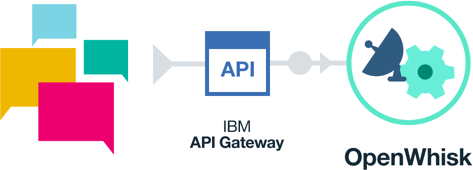

# OpenWhisk 빌딩 블럭 - HTTP REST API 트리거

*다른 언어로 보기: [English](README.md).*

IBM Bluemix의 Apache OpenWhisk로 REST API 매핑을 생성하십시오. 이 튜토리얼을 완료하기까지 5분 정도 소요됩니다. 이후 [_openwhisk-hands-on-demo_](https://github.com/search?q=topic%3Aopenwhisk-hands-on-demo+org%3AIBM&type=Repositories)로 태그된 것과 같은 복잡한 서버리스 애플리케이션으로 이동하십시오.



만약 OpenWhisk 프로그래밍 모델에 익숙하지 않은 경우, [액션, 트리거 그리고 
룰에 대한 예제를 먼저 확인 하십시오](https://github.com/IBM/openwhisk-action-trigger-rule).
[Bluemix 계정과 최신 버전의 OpenWhisk 명령행 도구가 필요합니다](https://github.com/IBM/openwhisk-action-trigger-rule/blob/master/docs/OPENWHISK-ko.md).

이 예제는 OpenWhisk `create-cat`과 `fetch-cat` 액션에 대응되는 HTTP `POST`와 `GET` 메소드에 대한 두 개의 REST 엔드포인트를 제공합니다.

1. [OpenWhisk 액션 생성하기](#1-openwhisk-액션-생성하기)
2. [REST 엔드포인트 생성하기](#2-rest-엔드포인트-생성하기)
3. [정리하기](#3-정리하기)

# 1. OpenWhisk 액션 생성하기
## cat 엔티티를 생성하는 액션 만들기
`create-cat.js`이란 이름의 파일을 생성하십시오. 이 파일은 JavaScript 함수로 작성된 OpenWhisk 액션을 정의하게 됩니다. 이 함수는 요청된 매개 변수 (`name` 및 `color`)를 확인하며 cat에 대한 고유한 id를 리턴하거나 매개 변수가 없는 경우 오류를 리턴합니다.
> **참고**: 이 예제는 단순화 된 것이며 백엔드 데이터 저장소와 연결되어 있지 않습니다. 좀 더 복잡한 예제는, [REST API 예제](https://github.com/IBM/openwhisk-serverless-apis)를 참고하시기 바랍니다.

```javascript
function main(params) {

  return new Promise(function(resolve, reject) {

    if (!params.name) {
      reject({
        'error': 'name parameter not set.'
      });
    } else {
      resolve({
        id: 1
      });
    }

  });

}
```

## cat 엔티티를 리턴하는 액션 만들기
`fetch-cat.js`이란 이름의 파일을 생성하십시오. 이 파일은 JavaScript 함수로 작성된 OpenWhisk 액션을 정의하게 됩니다. 이 함수는 요청된 매개 변수 (`id`)를 확인하며 Tabby색 고양이 Tahoma를 리턴합니다.
> **참고**: 다시 말하지만, 단순화된 데모용으로 백엔드 데이터 저장소 연결보다는 항상 Tahoma를 리턴합니다.

```javascript
function main(params) {

  return new Promise(function(resolve, reject) {

    if (!params.id) {
      reject({
        'error': 'id parameter not set.'
      });
    } else {
      resolve({
        id: params.id,
        name: 'Tahoma',
        color: 'Tabby'
      });
    }

  });

}
```

## 액션 업로드하기
다음 단계에서는 방금 생성한 JavaScript 함수로 부터 OpenWhisk 액션을 생성하게 됩니다. 이들 액션에 `--web true`라는 플래그를 추가하여 "Web Actions"로서 인식하도록 합니다. 이는 나중에 REST 엔드 포인트를 추가할 때 필요합니다.
```bash
wsk action create create-cat create-cat.js --web true
wsk action create fetch-cat fetch-cat.js --web true
```

## 액션에 대해 단위 테스트하기
OpenWhisk 액션은 명백하게 호출되거나 이벤트에 대응하는 무상태(stateless) 코드 조각입니다. 지금은, 명백하게 호출하는 방법으로 액션을 테스트 하게 됩니다. 나중에는, HTTP 요청에 대응하여 액션을 호출하게 됩니다. 아래 코드로 액션을 호출하고 `--param` 명령줄 인수를 사용하여 매개 변수를 전달하십시오.

```bash
wsk action invoke \
  --blocking \
  --param name Tahoma \
  --param color Tabby \
  create-cat

wsk action invoke \
  --blocking \
  --param id 1 \
  fetch-cat
```

> **참고**: 오류 메시지가 보이는 경우 아래 [문제 해결](#문제-해결) 영역을 참고 하십시오.

# 2. REST 엔드포인트 생성하기
## `/v1/cat` 엔드포인트에 대한 POST와 GET REST 매핑 생성하기
지금까지 OpenWhisk 액션을 생성했고, 이제 Bluemix API 게이트웨이를 통해 OpenWhisk 액션을 노출하게 됩니다. 이를 위해 이 명령을 이용합니다: `wsk api create $BASE_PATH $API_PATH $API_VERB $ACTION `

이 기능은 [Bluemix Native API Management](https://console.ng.bluemix.net/docs/openwhisk/openwhisk_apigateway.html#openwhisk_apigateway)의 일부이며 현재 보안, 속도 제한 등과 같은 매우 강력한 API 관리 기능을 제공합니다. 비록 지금은 단지 CLI를 사용하여 public REST endpoint로 액션을 노출하고 있습니다.

```bash
# 명령과 함께 신임 정보를 보내거나 대화식으로 제공합니다
wsk bluemix login --user $YOUR_BLUEMIX_USERNAME --password $YOUR_BLUEMIX_PASSWORD

# POST로 노출 /v1/cat {"name": "Tahoma", "color": "Tabby"}
wsk api create -n "Cats API" /v1 /cat post create-cat

# 노출 /v1/cat?id=1
wsk api create /v1 /cat get fetch-cat
```
CLI는 두 가지 경우 모두 API 이용을 위한 URL을 출력합니다. 다음 영역에서 사용을 위해 모든 정보를 기록해 두십시오.

## `curl` HTTP 요청으로 테스트 하기
앞서 명령으로 생성된 API URL을 가져옵니다. 액션 테스트를 위해 `curl`을 사용하여 http POST와 GET 요청을 보냅니다. 필요로하는 매개 변수 전달을 위해 POST에 대해서는 요청의 body에, GET에 대해서는 경로로 전달되는 것을 기억하십시오. OpenWhisk는 이와 같은 매개변수를 액션에 자동으로 전달합니다.

```bash
# POST /v1/cat {"name": "Tahoma", "color": "Tabby"}
curl -X POST -H 'Content-Type: application/json' -d '{"name":"Tahoma","color":"Tabby"}' $THE_URL_FROM_ABOVE

# GET /v1/cat?id=1
curl $THE_URL_FROM_ABOVE?id=1
```

# 3. 정리하기
## 모든 API 매핑을 제거하고 액션을 삭제하십시오

```bash
# 모든 매핑을 제거하는 API 베이스 삭제
wsk api delete /v1

# 액션 삭제
wsk action delete create-cat
wsk action delete fetch-cat
```

# 문제 해결
가장 먼저 OpenWhisk 활성화 로그에서 오류를 확인 하십시오. 명령창에서 `wsk activation poll`을 이용하여 로그 메시지를 확인하거나 [Bluemix의 모니터링 콘솔](https://console.ng.bluemix.net/openwhisk/dashboard)에서 시각적으로 상세정보를 확인해 보십시오.

오류가 즉각적으로 분명하지 않다면, [최신 버젼의 `wsk` CLI](https://console.ng.bluemix.net/openwhisk/learn/cli)가 설치되어 있는지 확인하십시오. 만약 이전 것이라면 다운로드하고 업데이트 하십시오.
```bash
wsk property get --cliversion
```

# 라이센스
[Apache 2.0](LICENSE.txt)
